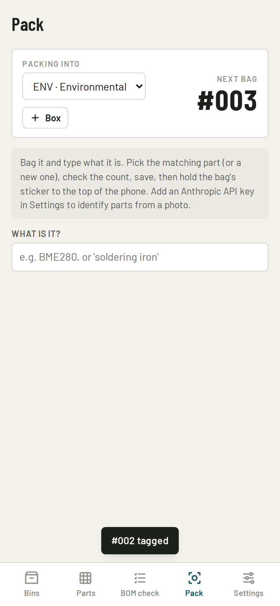
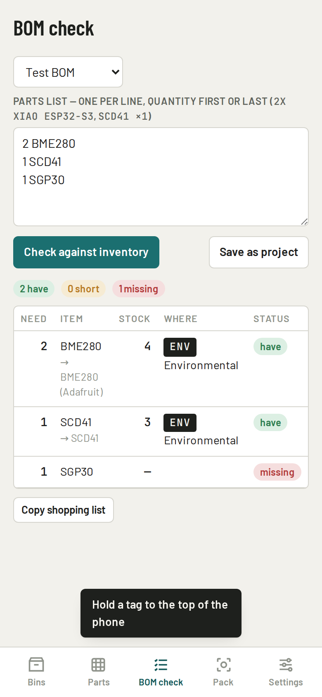
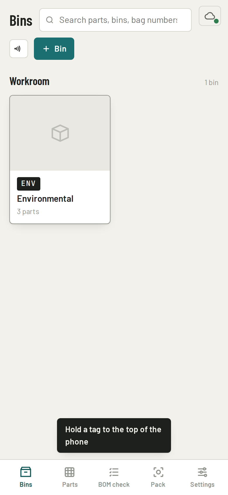

# Parts Bin

**Use it: [junkdrawer.works/parts-bin](https://junkdrawer.works/parts-bin/)**

**A parts inventory for a maker's workroom, with the NFC tags written and read right in the page.** Bins, moving boxes and numbered bags, a search over everything, and a BOM check that says what you have, what you're short of and where it is. Log a bag and tag it in one go: save the part, hold the sticker to the top of the phone, next bag.

<p align="center">
  
  
  
</p>

## How it works

- **Pack.** Pick the bin or box you're filling, type what's in the bag and pick the match (or a new part), check the count, save. The tag screen opens already listening: hold a blank sticker to the phone and it gets that bag's link. The next bag number is waiting.
- **Tap a tag to find a bag.** While Parts Bin is open it listens for tags, so holding any bag or bin sticker to the phone opens it right here. (The first time, tap the tag button by the search box to allow NFC; after that it starts by itself.) Tags written by the old Stockroom artifact open here too, with an offer to rewrite them so they open Parts Bin even when the page is closed.
- **BOM check.** Paste a parts list, or pick a saved one, and get have / short / missing with where each part lives, plus a shopping list.
- **Boxes for a move.** A box is a container like a bin; each part remembers which bin it came out of, and a box page prints its packing list.
- **Same on every device.** Turn on Google Drive in Settings and the inventory is saved to a "Parts Bin" folder in your Drive and merged part by part with your other devices. Without it, everything stays in this browser.
- **Photo identification, optional.** With your own Anthropic API key (Settings), Pack can identify a part from a photo and BOM check can match loose wording. The key stays in that browser.

NFC needs Chrome on Android. Everything else works in any browser.

### What's saved where

- **In this browser:** the inventory (localStorage), the API key if you add one, and your sign-in for Drive.
- **In your Google Drive, if you turn it on:** one file, `Parts Bin/Parts Bin.json`, with bins, parts and saved BOMs. junkdrawer.works can only see files it made. To take the permission back, remove junkdrawer.works under Third-party apps & services in your Google Account.
- **Nothing else leaves the page,** except photos and lists sent to Anthropic when you use identification.

## Running it

It's a static site: plain HTML, CSS and JavaScript, with no build step.

```sh
npx http-server -p 8080 -c-1 .   # then open http://localhost:8080
npm test                         # merge rules, then the page in Chromium with a pretend NFC reader and Drive
node tools/screenshots.mjs       # og.png (the README phone shots come from npm test)
node tools/make-icons.mjs        # PNG icons from icon.svg
```

GitHub Pages serves it from `main`, `/ (root)`.

### Files

- `index.html`, `css/app.css`: the page.
- `js/app.js`: the screens (bins, parts, BOM check, pack, settings) and the NFC tag writer and reader.
- `js/model.js`: the inventory document and the item-by-item merge; unit-tested in `test/model.test.mjs`.
- `js/store.js`: keeps it in localStorage and imports Stockroom exports and backups.
- `js/sync.js`: optional Google Drive saving, the junkdrawer.works way.
- `js/ai.js`: optional photo identification with your own API key.
- `test/e2e.mjs`, `test/fake-google.mjs`: drive the page with a pretend NFC reader and a stand-in Google Drive.
- `fonts/`: Barlow, Barlow Condensed and JetBrains Mono, served from here so nothing loads from elsewhere (SIL Open Font License).
- `sw.js`, `manifest.webmanifest`, `icon*.png`, `icon.svg`: works offline and installs to the home screen.
